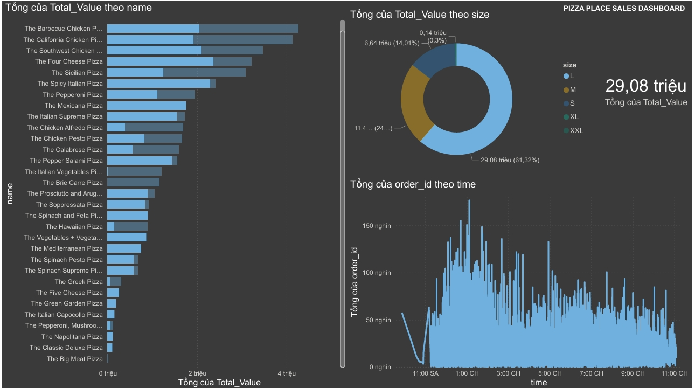

# Phân tích Doanh thu Cửa hàng Pizza (Pizza Place Sales Analysis)

## 🔗 Live Portfolio / Website
Xem dự án trên trang cá nhân của tôi

## 📌 Tổng quan dự án (Project Overview)
Dự án này tập trung vào việc khai thác dữ liệu vận hành của một chuỗi cửa hàng Pizza với hơn 48.000 giao dịch trong một năm. Mục tiêu trọng tâm là sử dụng SQL Server để trích xuất dữ liệu từ các bảng quan hệ phức tạp, sau đó trực quan hóa trên Power BI để tìm ra các cơ hội tối ưu hóa doanh thu và nhân sự.

Dự án trả lời các câu hỏi kinh doanh then chốt:
* Khung giờ nào là "giờ vàng" cần tăng cường nhân viên?
* Những loại Pizza nào là "Best Seller" mang lại lợi nhuận cao nhất?
* Xu hướng tiêu dùng theo kích cỡ bánh (Size) để tối ưu kho nguyên liệu.

## 📊 Dữ liệu sử dụng (Dataset)
* **Nguồn:** Pizza Place Sales Dataset (Kaggle).
* **Cấu trúc:** Hệ thống cơ sở dữ liệu quan hệ gồm 4 bảng: Orders, Order_Details, Pizzas, và Pizza_Types.
* **Quy mô:** Hơn 48.000 bản ghi chi tiết đơn hàng.

## 🛠️ Công nghệ & Kỹ thuật sử dụng (Tech Stack)
* **Cơ sở dữ liệu:** Microsoft SQL Server (SSMS).
* **Kỹ thuật SQL (ETL):**
  - Sử dụng `INNER JOIN` để liên kết 4 bảng dữ liệu.
  - Dùng các hàm thời gian `DATEPART`, `DATENAME` để phân tích xu hướng theo giờ/ngày/tháng.
  - Áp dụng `GROUP BY` cùng các hàm tổng hợp `SUM`, `COUNT` để tính toán KPI.
  - Tạo `VIEW` để chuẩn hóa dữ liệu đầu ra cho Power BI.
* **Công cụ BI:** Power BI Desktop để thiết kế Dashboard tương tác.
* **Phân tích nâng cao:** Sử dụng ngôn ngữ DAX để tính toán các chỉ số động trên Dashboard.

## 💡 Kết quả phân tích (Key Insights)
* **Khung giờ cao điểm (Peak Hours):**  
  Lượng đơn hàng tăng vọt vào khung giờ trưa (12:00 - 13:00) và buổi tối (17:00 - 19:00). Đây là thông tin quan trọng để quản lý điều phối nhân sự bếp và shipper.

* **Sản phẩm dẫn đầu (Top Performers):**  
  Các loại Pizza như *The Classic Deluxe* và *The Thai Chicken* là những mặt hàng đóng góp doanh thu lớn nhất.

* **Phân tích kích cỡ (Size Analysis):**  
  Size L chiếm tỷ trọng doanh thu cao nhất, cho thấy khách hàng ưu tiên lựa chọn kích cỡ lớn khi đặt hàng, giúp tăng giá trị trung bình trên mỗi đơn hàng (AOV).

## 🖼️ Hình ảnh Demo (Visualizations)

1. **Dashboard Toàn diện (Power BI)**  
   

## 🚀 Cấu trúc thư mục
* `pizza_sales_queries.sql`: File chứa toàn bộ mã nguồn SQL thực hiện ETL và trích xuất chỉ số.
* `Pizza_Sales_Dashboard.pbix`: File thiết kế Dashboard Power BI.
